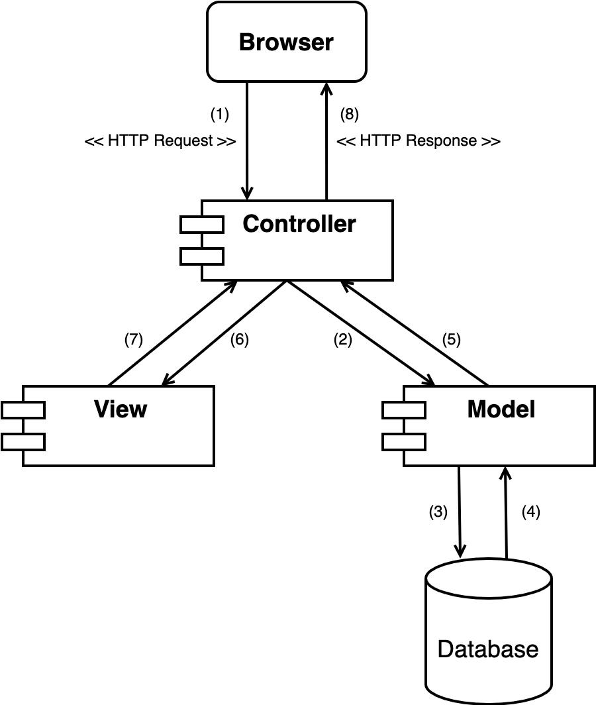
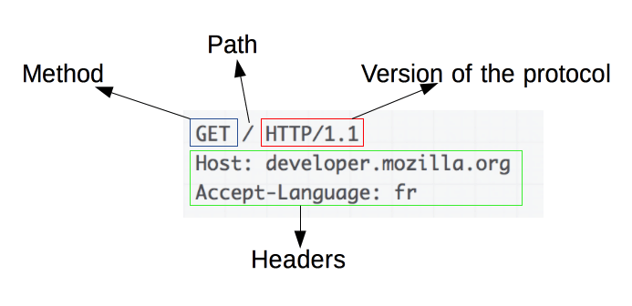
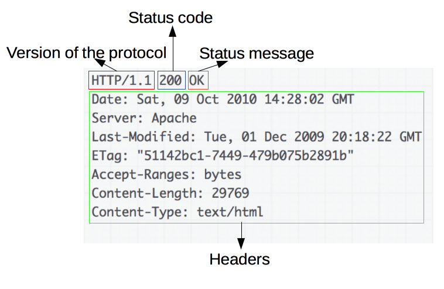

# Training Backend

## Purpose

* Providing basic knowledge of Web Application and Web Development
* Knowing how to use different types of HTTP Request and HTTP Response
* Building a full basic functionality Web Server

## Require

* Object-oriented programming skills with `Python`
* Library management with `Pip`
* Basic knowledge of `MongoDB` database and `PyMongo` library

## Theory

*Reference: [HTTP](https://developer.mozilla.org/en-US/docs/Web/HTTP)*

### MVC Architecture

MVC is an architectural pattern which means it rules the whole architecture of the applications.

[//]: # (![MVC Architecture]&#40;images/mvc.png&#41;)

    

* Model: Contains all the objects that describe the data such as classes, data processing methods, and is responsible for accessing data on the database.
* View: A collection of user interface files.
* Controller: Keeping the task of handling user requests, Controller will call Model to manipulate the database and return the user interface through View.

> *Task 1: Descript MVC model operation flow*

*Reference: [Đôi điều về mô hình MVC](https://viblo.asia/p/doi-dieu-ve-mo-hinh-mvc-E375z0vJZGW)*

### HTTP Request

[//]: # (![HTTP Request]&#40;images/http_request.png&#41;)

    

Requests consist of the following elements:

* `HTTP method`: Defines the operation the client wants to perform. Typically, a client wants to fetch a resource (using GET) or post the value of an HTML form (using POST).
* `Path`: The path of the resource to fetch.
* `Version`: The version of the HTTP protocol.
* `Headers`: That convey additional information for the servers.
* `Body`: (optional) For some methods like POST, which contain the resource sent.

> *Task 2: List HTTP methods and their usage*

*Reference: [Requests](https://developer.mozilla.org/en-US/docs/Web/HTTP/Overview#requests)*

### HTTP Response

[//]: # (![HTTP Response]&#40;images/http_response.png&#41;)

    

Responses consist of the following elements:

* `Version`: The version of the HTTP protocol.
* `Status Code`: Indicating if the request was successful or not, and why.
* `Status Message`: A non-authoritative short description of the status code.
* `Headers`: That convey additional information for the servers.
* `Body`: (optional) Containing the fetched resource.

> *Task 3: List HTTP response status codes and their meanings*

*Reference: [Responses](https://developer.mozilla.org/en-US/docs/Web/HTTP/Overview#responses)*

### RESTful API with CRUD

| Action                 | Method | Path           |
|------------------------|--------|----------------|
| Get all entities       | GET    | /entities      |
| Create an entity       | POST   | /entities      |
| Get an entity by ID    | GET    | /entities/{id} |
| Update an entity by ID | PUT    | /entities/{id} |
| Delete an entity by ID | DELETE | /entities/{id} |

*Reference: [RESTful API là gì ?](https://viblo.asia/p/restful-api-la-gi-1Je5EDJ4lnL)*

## Practice

> Follow the instructions in the project [TrainingAPI](TrainingAPI)

## Lộ trình đào tạo Backend (Toàn diện)

Mục tiêu: Cung cấp kiến thức và kỹ năng để thiết kế, xây dựng, bảo mật, tối ưu và triển khai một kiến trúc backend hoàn chỉnh — từ lý thuyết cơ bản đến các kỹ thuật nâng cao về hiệu năng, độ sẵn sàng và vận hành.

Hướng dẫn sử dụng phần này: Mỗi module gồm kiến thức lý thuyết, ví dụ thực hành, bài tập và bài kiểm tra nhỏ. Hoàn thành tuần tự sẽ giúp học viên có thể triển khai một hệ thống backend thực tế.

Chuẩn đầu ra (learning outcomes):

- Hiểu cấu trúc và cách hoạt động của một backend service (HTTP, REST/gRPC, routing, middleware).
- Thiết kế mô hình dữ liệu phù hợp và tối ưu truy vấn cơ sở dữ liệu.
- Áp dụng các cơ chế bảo mật: xác thực, phân quyền, mã hóa, quản lý bí mật và chống tấn công.
- Đo lường và tối ưu hiệu năng: profiling, caching, connection pooling, scale-out.
- Viết test (unit/integration/contract), CI/CD, container hoá và triển khai an toàn.
- Giám sát, logging, tracing và phản hồi sự cố trong môi trường production.

Checklist khóa học (tự đánh giá):

- [ ] Hoàn thành các bài học lý thuyết cho từng module
- [ ] Thực hành mẫu (API CRUD + auth) với Project `TrainingAPI`
- [ ] Hoàn thành bài tập tối ưu hiệu năng & load-test
- [ ] Thiết lập pipeline CI/CD đơn giản (ví dụ GitHub Actions)
- [ ] Thiết lập monitoring cơ bản (metrics + logs)

Module 1 — Kiến thức cơ bản và nền tảng

- HTTP/HTTPS, REST vs gRPC, WebSocket
- Architecture patterns: Monolith, Modular Monolith, Microservices, Serverless
- MVC, Layers (Controller-Service-Repository), Dependency Injection
- API design: resource modeling, versioning, pagination, filtering, HATEOAS (cơ bản)
- CORS, content negotiation, status codes, idempotency

Bài tập Module 1:

- Xây dựng API CRUD cho thực thể `books` (GET/POST/PUT/DELETE) trong `TrainingAPI`.
- Thêm validation request (JSON schema) và trả lỗi chuẩn.

Module 2 — Cơ sở dữ liệu & Data Modeling

- Quan hệ (Postgres/MySQL) vs NoSQL (MongoDB): khi nào dùng gì
- Thiết kế schema: normalization vs denormalization
- Indexing, query planning, explain, phân tích hiệu suất truy vấn
- Transactions, isolation levels, optimistic vs pessimistic locking
- Backup/restore, replication (master-slave), sharding cơ bản

Bài tập Module 2:

- Thiết kế và triển khai mô hình dữ liệu cho hệ thống thư viện (books, authors, users, borrows)
- Viết các câu truy vấn tối ưu và tạo index phù hợp; kiểm tra bằng explain

Module 3 — Xác thực & Ủy quyền (Authentication & Authorization)

- Authentication: sessions, JWT, OAuth2 (authorization code, client credentials), OpenID Connect
- Authorization: RBAC, ABAC, permission model
- Secure password storage (bcrypt/argon2), token lifecycle, refresh tokens, token revocation
- Best practices: secure cookies, SameSite, CSRF protection

Bài tập Module 3:

- Thực hiện đăng ký/đăng nhập bằng JWT; có refresh token và cơ chế thu hồi token
- Thêm role-based access control cho endpoint (admin vs user)

Module 4 — Bảo mật ứng dụng (Security)

- OWASP Top 10 (thực hành chống SQL/NoSQL injection, XSS, CSRF, insecure deserialization...)
- TLS/HTTPS, HSTS, certificate management (Let’s Encrypt)
- Secrets management: môi trường, vault (HashiCorp Vault), hạn chế secret trong code
- Rate limiting, brute-force protection, input validation và output encoding
- Logging an toàn: không log sensitive data, mask/ redact

Bài tập Module 4:

- Thực hành hardening API: bật HTTPS (local dev sử dụng self-signed), áp dụng rate limit, validate và sanitize input

Module 5 — Hiệu năng & Tối ưu (Performance & Scalability)

- Profiling: CPU, memory, I/O; công cụ profiling Python (py-spy, cProfile)
- Caching strategies: in-memory (process), distributed cache (Redis), HTTP caching (ETag, Cache-Control)
- Connection pooling, keepalive, database pool sizing
- Asynchronous processing: background jobs (Celery/RQ), message brokers (RabbitMQ, Kafka)
- Concurrency models: threading, multiprocessing, async/await (asyncio / FastAPI)
- Load balancing, horizontal scaling, sticky sessions
- Compression (gzip, brotli), HTTP/2, keep-alive, persistent connections

Bài tập Module 5:

- Thực hiện benchmark API (wrk/k6/locust), đo CPU/memory, tìm cổ chai
- Thêm caching cho endpoints nặng và đánh giá cải thiện

Module 6 — Độ tin cậy & Resilience

- Retry, exponential backoff, idempotency, circuit breaker, bulkhead pattern
- Graceful shutdown, health checks (liveness/readiness), connection draining
- Data consistency: eventual consistency, saga pattern, compensating transactions

Bài tập Module 6:

- Cài đặt circuit breaker cho service gọi ngoài (mô phỏng service down)
- Thực hành graceful shutdown khi container nhận SIGTERM

Module 7 — Testing & Quality Assurance

- Unit tests, integration tests, contract tests (Pact), end-to-end tests
- Test doubles: mocks, stubs, fakes; database testing strategy (test db, fixtures)
- Property-based testing và test coverage
- Static analysis và linting: flake8/black/mypy (Python)

Bài tập Module 7:

- Viết unit và integration test cho các endpoint chính (sử dụng pytest)
- Thiết lập GitHub Actions để chạy test khi PR

Module 8 — CI/CD, Containerization & Deployment

- Docker cơ bản: Dockerfile best practices, multi-stage builds
- CI pipelines: linting, tests, build, container publish
- CD: deploy strategies (rolling, blue/green, canary), infra as code (Terraform cơ bản)
- Container orchestration: Docker Compose (dev), Kubernetes (overview)

Bài tập Module 8:

- Viết Dockerfile cho `TrainingAPI` và docker-compose để chạy dev environment
- Tạo pipeline CI đơn giản (GitHub Actions) build/test/push image

Module 9 — Observability: Logging, Metrics, Tracing

- Logging: structured logs (JSON), correlation id, log levels
- Metrics: Prometheus exposition, key metrics (latency, error rate, throughput, saturation)
- Tracing: distributed tracing (OpenTelemetry, Jaeger)
- Alerting: SLOs/SLIs, alert rules, runbook cơ bản

Bài tập Module 9:

- Thêm structured logging vào `TrainingAPI` và xuất metrics đơn giản
- Tích hợp tracing cho một request xuyên service (mock)

Module 10 — Advanced Topics & Patterns

- Event-driven architectures, pub/sub, stream processing
- CQRS, event sourcing (giới thiệu)
- GraphQL vs REST, gRPC performance tradeoffs
- Cost optimization, autoscaling strategies, cache invalidation patterns

Bài tập Module 10 (Dự án cuối khoá):

- Thiết kế và triển khai một mini-project tích hợp: API CRUD + Auth + Background jobs + Caching + CI/CD + Basic monitoring
- Viết report giải thích kiến trúc, lựa chọn công nghệ và những trade-offs

Tài nguyên & công cụ đề xuất

- Languages/frameworks: Python (Flask/FastAPI), Node.js (Express/NestJS), Java (Spring Boot)
- Databases: PostgreSQL, MongoDB, Redis
- Messaging: RabbitMQ, Kafka
- Testing: pytest, requests, httpx, Pact
- Load testing: k6, locust, wrk
- Monitoring/tracing: Prometheus, Grafana, Jaeger, OpenTelemetry
- CI/CD: GitHub Actions, GitLab CI

Đánh giá & bài kiểm tra

- Bài kiểm tra lý thuyết (multiple-choice) cho từng module
- Bài tập thực hành + bài tập tối ưu hiệu năng
- Dự án cuối khóa: triển khai hệ thống hoạt động và có tài liệu kiến trúc

Gợi ý lộ trình thời gian (mẫu)

- 1 tuần (cơ bản + DB + Auth + security)
- 1 tuần (performance + testing + deployment)
- 2 tuần (dự án cuối + polish + monitoring)

Next steps đề xuất cho repo này

- Tách các phần hướng dẫn chi tiết từng module vào `docs/` (ví dụ `docs/modules/*.md`)
- Thêm bài tập có kịch bản và test harness trong `tests/` để auto-điểm
- Thêm mẫu GitHub Actions workflow và Dockerfile tối ưu (nếu chưa có)

---