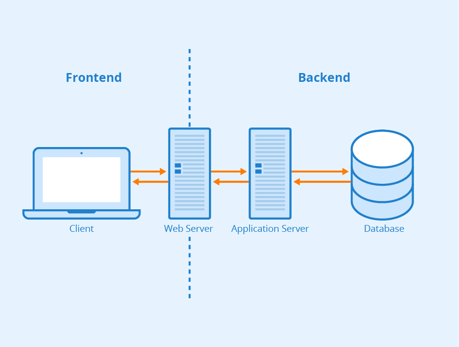

# Module 1 — Kiến thức cơ bản và nền tảng

## Lý thuyết
Trình bày các khái niệm cơ bản về backend:
- Backend là gì, vai trò của nó trong hệ thống tổng thể, và cách nó tương tác với frontend và các thành phần khác.
- mô hình client-server
- HTTP/HTTPS, 
- REST, 
- RPC/gRPC, 
- WebSocket

# Mô hình Client – Server

Mô hình Client–Server là nền tảng của hầu hết các hệ thống phần mềm hiện đại. Trong mô hình này, hệ thống được chia thành hai phần: client là nơi người dùng tương tác (web, mobile), và server là nơi xử lý logic nghiệp vụ và quản lý dữ liệu.

Khi người dùng thực hiện một hành động, client sẽ gửi yêu cầu đến server. Server tiếp nhận, xử lý và trả về kết quả để client hiển thị. Toàn bộ quá trình này diễn ra liên tục và tạo nên cách các ứng dụng hoạt động trong thực tế.

Việc hiểu mô hình Client–Server giúp làm rõ vai trò của backend: backend chính là phần server, chịu trách nhiệm xử lý, điều phối và cung cấp dữ liệu cho toàn bộ hệ thống.

# Backend là gì?

## 1. Định nghĩa

Backend là phần xử lý phía máy chủ (server-side) trong một hệ thống phần mềm. Đây là nơi thực hiện các logic nghiệp vụ, xử lý dữ liệu, xác thực người dùng và giao tiếp với cơ sở dữ liệu.

Người dùng cuối không trực tiếp nhìn thấy backend, nhưng mọi hành động của họ trên giao diện (frontend) đều được backend xử lý và phản hồi.

---

## 2. Vai trò của Backend trong hệ thống

Backend đóng vai trò trung tâm trong kiến trúc hệ thống, với các trách nhiệm chính:

### 2.1. Xử lý logic nghiệp vụ (Business Logic)
- Thực hiện các quy tắc nghiệp vụ của hệ thống
- Kiểm tra tính hợp lệ của dữ liệu
- Điều phối luồng xử lý giữa các thành phần

Ví dụ:
- Tính toán phí giao dịch
- Xác định quyền truy cập của người dùng
- Xử lý quy trình nghiệp vụ (workflow)

---

### 2.2. Quản lý và lưu trữ dữ liệu
- Tương tác với database (PostgreSQL, MySQL, MongoDB, ...)
- Thực hiện CRUD (Create, Read, Update, Delete)
- Đảm bảo tính toàn vẹn và nhất quán của dữ liệu

---

### 2.3. Xác thực và phân quyền (Authentication & Authorization)
- Xác minh danh tính người dùng (JWT, OAuth, session, ...)
- Kiểm soát quyền truy cập tài nguyên

---

### 2.4. Cung cấp API cho client
- Backend expose các API (REST, gRPC, GraphQL, ...)
- Frontend hoặc các hệ thống khác gọi API để lấy dữ liệu hoặc thực hiện hành động

---

### 2.5. Tích hợp hệ thống (Integration)
- Giao tiếp với các service khác (microservices)
- Kết nối với hệ thống bên thứ ba (payment, email, SMS, ...)

---

## 3. Backend tương tác với Frontend như thế nào?

### 3.1. Mô hình Client-Server

Frontend (client) gửi request đến backend (server), backend xử lý và trả về response.

Luồng cơ bản:

1. Người dùng thao tác trên giao diện (frontend)
2. Frontend gửi HTTP request đến backend
3. Backend xử lý request
4. Backend truy vấn database hoặc gọi service khác
5. Backend trả response về frontend
6. Frontend hiển thị kết quả cho người dùng


---

### 3.2. Ví dụ minh họa

```text
[User] 
   ↓
[Frontend (React / Web / Mobile)]
   ↓ HTTP Request (REST API)
[Backend (API Server)]
   ↓
[Database / External Services]
   ↑
[Backend trả Response (JSON)]
   ↑
[Frontend render UI]
```

# Các giao thức phổ biến trong Web/App

## 1. HTTP / HTTPS

- Giao thức nền tảng của web
- Mô hình: request → response
- Stateless (mỗi request độc lập)

**HTTP methods chính:**
- GET: lấy dữ liệu
- POST: tạo mới
- PUT/PATCH: cập nhật
- DELETE: xóa

**HTTPS:**
- HTTP + SSL/TLS
- Mã hóa dữ liệu khi truyền
- Bắt buộc trong hệ thống production

**Use case:**
- REST API
- Web application
- Mobile app backend

---

## 2. WebSocket

- Giao thức kết nối 2 chiều (full-duplex)
- Giữ kết nối liên tục giữa client và server
- Không cần request lại như HTTP

**Đặc điểm:**
- Real-time
- Low latency
- Server có thể push data chủ động

**Use case:**
- Chat
- Notification realtime
- Live data (stock, tracking, game)

---

## 3. gRPC

- Giao thức RPC hiệu năng cao (Google)
- Sử dụng HTTP/2
- Dữ liệu dạng binary (Protocol Buffers)

**Đặc điểm:**
- Nhanh hơn REST (JSON)
- Strongly typed
- Hỗ trợ streaming

**Use case:**
- Microservices communication
- Internal service-to-service

---

## 4. TCP/IP

- Giao thức nền tảng của network
- Tất cả các giao thức (HTTP, WebSocket, gRPC) đều chạy trên TCP/IP

**TCP:**
- Reliable (đảm bảo dữ liệu)
- Có kiểm soát lỗi, thứ tự

**IP:**
- Định tuyến gói tin

---

## 5. Message Protocol (AMQP, MQTT)

### AMQP
- Dùng trong message queue (ví dụ RabbitMQ)
- Đảm bảo delivery, routing phức tạp

**Use case:**
- Async processing
- Event-driven system

### MQTT
- Lightweight protocol
- Tối ưu cho băng thông thấp

**Use case:**
- IoT
- Device communication

---

## Tổng kết

| Giao thức   | Đặc điểm chính              | Use case chính                  |
|------------|---------------------------|--------------------------------|
| HTTP/HTTPS | Request–response, stateless | Web, REST API                  |
| WebSocket  | Real-time, 2 chiều         | Chat, live data                |
| gRPC       | High performance, binary   | Microservices                  |
| TCP/IP     | Network foundation         | Tất cả hệ thống                |
| AMQP/MQTT  | Messaging, async           | Queue, IoT                     |


# Postman

## 1. Khái niệm

Postman là công cụ dùng để **gửi request và kiểm tra API**.  
Nó cho phép làm việc trực tiếp với backend mà không cần frontend.

---

## 2. Mục đích sử dụng

- Test API trong quá trình phát triển
- Debug request/response
- Xác minh logic backend
- Làm việc độc lập giữa backend và frontend

---

## 3. Thành phần quan trọng

### Request

Một request trong Postman gồm:

- **Method**: GET, POST, PUT, DELETE...
- **URL**: endpoint API
- **Headers**: metadata (Authorization, Content-Type…)
- **Params**: query parameters
- **Body**: dữ liệu gửi lên (JSON, form-data…)

---

### Response

Postman hiển thị:

- **Status code**: 200, 400, 401, 500…
- **Response body**: dữ liệu trả về (thường là JSON)
- **Headers**
- **Response time**

→ Dùng để kiểm tra API đúng/sai

---

### Collection

- Nhóm các API lại với nhau
- Dùng để:
  - Tổ chức API
  - Test nhiều API liên quan
  - Share cho team

---

### Environment

- Lưu biến dùng chung:
  - `base_url`
  - `token`
- Tách môi trường:
  - local / dev / staging / prod

→ Tránh hardcode, dễ chuyển môi trường

---

### Authentication

Hỗ trợ sẵn:

- Bearer Token (JWT)
- Basic Auth
- OAuth2
- API Key

→ Test bảo mật API nhanh

---

## 4. Workflow chuẩn

1. Backend viết API
2. Dùng Postman gửi request test
3. Debug nếu có lỗi
4. Lưu vào collection
5. Share cho frontend / QA

---

## 5. Khi nào cần Postman

- Phát triển API
- Debug lỗi backend
- Test authentication
- Test integration trước khi có frontend

---

## Tổng kết

Postman là công cụ cơ bản nhưng bắt buộc trong backend:

- Test API nhanh
- Debug dễ
- Tách frontend khỏi backend khi phát triển
